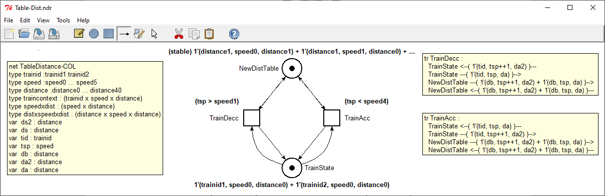

<!-- PROJECT LOGO -->
<br />
<p align="center">
  <a href="https://github.com/dalzilio/mcc">
    
  </a>

  <p align="center">
    A tool to remove colors from your High-Level Petri nets !
    <br />
    <a href="https://github.com/dalzilio/mcc#features"><strong>see what's new »</strong></a>
    <br />
    <!-- <a href="https://github.com/dalzilio/mcc">View Demo</a> -->
  </p>
</p>

## About

MCC is a tool designed for a very specific and narrow task: to transform the
models of High-Level Petri nets, given in [PNML](http://www.pnml.org/), into
equivalent Place/Transition nets.

[](https://goreportcard.com/report/github.com/dalzilio/mcc)
[](https://godoc.org/github.com/dalzilio/mcc)
[](https://github.com/dalzilio/mcc/releases)


## Overview

The name of the tool derives from the annual [Model-Checking
Contest](https://mcc.lip6.fr/), a competition of model-checking tools that
provides a large and diverse collection of PNML models. Our choice in naming
serves to underline the main focus of the tool, which is to provide a simple,
open and extensible solution to lower the access cost for developers that would
like to engage in this competition.

MCC supports the generation of Petri nets in both the TINA (.net) and LOLA input
formats. We have also recently added a new subcommand to output the result as a
P/T net in PNML format.

We have made many improvements on the tool along the years and it is now a very
efficient solution, on par with (and on many instances more efficient than)
other tools used for the same purpose.

In the future, we plan to use the transformation to compute interesting
properties of the models, like symmetries and/or set of places that can be
clustered together.

## Reference

* Silvano Dal Zilio. [MCC: a Tool for Unfolding Colored Petri Nets in PNML
  Format](https://hal.laas.fr/hal-02511881). _41st International Conference on
  Application and Theory of Petri Nets and Concurrency_, Jun 2020, Paris,
  France. ⟨hal-02511881⟩

## Installing MCC or building it from source

MCC is a classic Command-Line Interface tool. You can directly install it by
copying the right binary file in your system. You can find the executable for
the latest releases on [GitHub's release page for this
project](https://github.com/dalzilio/mcc/releases). We provide binary files for
[Windows](https://github.com/dalzilio/mcc/releases/download/v1.5.0/mcc.exe),
[Linux](https://github.com/dalzilio/mcc/releases/download/v1.5.0/mcc-linux) and
[MacOS (Darwin)](https://github.com/dalzilio/mcc/releases/download/v1.5.0/mcc-darwin).

You also have the option to install the tool directly from source. For this, you
need first to install a recent Go distribution (available at
<https://golang.org/doc/install>). Then you can install the software using the
*go get* command.

```bash
$> go get github.com/dalzilio/mcc
```

You can browse the documentation for this tool on the [GoDoc page for the MCC
project](https://godoc.org/github.com/dalzilio/mcc).

## Running the program

The *mcc hlnet* command accepts PNML files for high-level nets provided by the
Model-Checking Contest (also tagged as COL). These files generally have the name
*model.pnml*. You can invoke the *hlnet* command on this file as follows.

```text
$> mcc hlnet -i model.pnml
```

You can obtain info on the other available options by using the *help* command:

```text
$> mcc help
collection of tools for the MCC

Usage:
  mcc [command]

Available Commands:
  hlnet       generates a .net or .tpn file from a PNML file describing a high-level net
  lola        generates a net file in the LoLa format from a PNML file describing a high-level net
  pnml        generates a P/T net file in PNML format from a PNML file describing a high-level net
  tina        generates a P/T net file in .net format

Use "mcc [command] --help" for more information about a command.

$> mcc help hlnet
generates a .net or .tpn file from a PNML file describing a high-level net

Usage:
  mcc hlnet -i file.pnml [flags]

Flags:
      --debug         output a readable version in a format that can be displayed by Tina
  -i, --file string   name of the input file (.pnml)
      --name          use PNML (document) name for the output file
  -o, --out string    basename of the output file (without extension, default to input file basename) or - for stdout
      --sliced        use structured naming for places
      --stats         print statistics (nb. of places, trans. and computation time); do not output the net
      --verbose       add extra information in the labels of the .net file
```

## Features

* We recognize the case of high-level nets with a single variable used with a
  circular symmetry (basically, this is a "scalar set"). This allows us to
  manage very big instances of the *Philosophers* model.

* We have improved the performances on colored models with a large number of
  variables. This means that we can now unfold model BART in a few seconds.

* We support the generation of Petri nets with more structured place names
  (option ```--sliced```) and with labels that add traceability information to
  the colored model (with option ```--verbose```). With these options, the output
  of the tool becomes more deterministic.

* We now support the declaration of ```finiteintrange``` types in PNML. as well
  as the declaration of ```Partition``` and ```PartitionElement```. This means
  that we can now unfold model VehicularWifi (surprise model in 2019)

* We have added a new option, ```--stats```, to print statistics about the
  computation, such as computation time, or the number of places and transitions
  in the resulting Place/Transition net. (We do not output a result when this
  option is used.)

  ```text
  $> mcc hlnet -i model.pnml --stats
  100 place(s), 429 transition(s), 858 arc(s), 0.027s
  ```
  
* We have modified option ```--debug``` in order to add more visual information
  when displaying the resulting model with ```nd``` (part of the [TINA
  toolbox](http://projects.laas.fr/tina/home.php)). We still display information
  about types, variables and the expressions associated with arcs inside
  comments. We also add a copy of this information using the support for
  (sticky) notes nodes that is built inside TINA's net format. You can see an
  example of the result obtained on the TableDistance-COL model below.
  
  

* You can now use parameter ```-``` with option ```-o``` to output the result of
  the unfolding on the standard output. This way it is possible to use ```mcc```
  to generate a P/T net and pipe the result to another program, for instance another
  conversion tool, such as ```ndrio```, which is part of the [TINA
  toolbox](http://projects.laas.fr/tina/home.php).

  ```text
  $> mcc hlnet -i model.pnml -o - | ndrio -romeo -
  ```

* We added a new subcommand, ```mcc pnml``` to output the result as a P/T net in
  PNML format.

* We added a new subcommand, ```mcc tina``` to output the result as a P/T net in
  TINA's net format.

## Dependencies

The code repository includes instances of PNML models from the [MCC Petri Nets
Repository](https://pnrepository.lip6.fr/) located inside the ```./benchmarks```
folder. We provide a selection of instances from all the PNML colored models
used in the 2019 Model-Checking Contest. These files are included in the
repository to be used for benchmarking and continuous testing.

## License

This software is distributed under the [CECILL-B](http://www.cecill.info)
license. A copy of the license agreement is found in the [LICENSE](./LICENSE)
file.

## Authors

* **Silvano DAL ZILIO** -  [LAAS/CNRS](https://www.laas.fr/)
